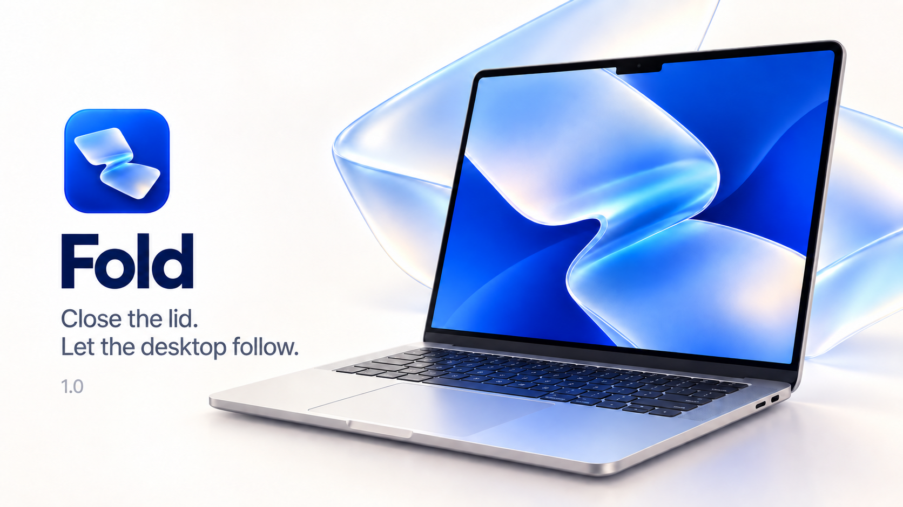

# Fold

A native, open-source MacBook utility inspired by the iPhone Duo's folding transition. Your desktop stays in place as you lower the lid. Progressive blur and soft side shadows follow the fold; the physical lid supplies the perspective.

Fold runs locally, with no account, analytics, recording files, network calls, or paid dependencies. MIT licensed.

[Download the app](https://github.com/mhadifilms/fold/releases/latest) · [Motion study](docs/motion-study.md) · [Preview video](docs/motion-preview.mp4)


## Use

1. Download and unzip the release, then move **Fold.app** to Applications.
2. Open it once and allow Screen Recording if macOS asks. Reopen after a new grant if needed.
3. Close Settings. Fold follows the lid automatically and starts at login. There is no menu bar icon by default.
4. Open Fold from Applications to change settings. **Command-Shift-Escape** pauses immediately.

The settings **Automatic folding** switch persists across launches. **Start at login** uses Apple's ServiceManagement registration; macOS may require approval in Login Items. The Dock icon is visible only while Settings is open. A menu bar control is optional.

The effect starts only while closing below **90°**. Opening to 90° clears it immediately. If you stop while reopening below 90°, it clears after 120 ms; continuing to reopen keeps the desktop clear. Closing again can start a new fold from that position. Holding still while closing clears within 450 ms, or 100 ms at 8° and below. Sensor loss, sleep and session changes clear the effect; continuously moving transitions are bounded to eight seconds.

There is one effect and no remembered starting angle. **Preview** plays the effect inside Settings using original sample artwork, without screen permission. The three settings control automatic folding, launch at login and the optional menu bar icon.

## Included in 1.0

- Automatic operation after setup, optional menu bar icon, persisted settings, native launch-at-login registration.
- The generated logo is included as both the Finder app icon and an explicitly loaded runtime icon, including Settings and Dock.
- Held-lid, nearly-closed, stale-sensor, sleep/wake and maximum-duration recovery.
- A fresh-frame handoff and 120 ms entrance blend remove the abrupt switch into the overlay. Closing motion warms capture before the fold begins.
- A continuous focus gradient with fixed desktop coordinates, informed by the Apple launch, product demonstration and Duo reference frames. A Gaussian pyramid avoids repeated horizontal blur bands, and pixels fill every edge.
- A visible end-to-end test for the actual capture and presentation pipeline, with an optional screen recording for local review.

Rendering follows the display up to 120 Hz. Capture stays ready at 1 fps when armed and clear, and releases completely after a safety reset or pause. The overlay changes pixels; other apps' click targets remain in their original positions.

## Permissions and signing

ScreenCaptureKit needs macOS Screen Recording access to draw the desktop effect. Audio is not captured. Frames stay in memory and are never saved or uploaded by normal operation.

The app checks permission on startup and requests it only if missing. Denying it leaves the generated preview available. macOS may still show its own periodic capture reminders; the app cannot suppress system security UI. Keep the same signed app in Applications to preserve its identity. Unsigned/ad-hoc rebuilds or changing signing identity may require authorization again.

The build script supports a Developer ID certificate through `SIGNING_IDENTITY`; it does not bundle credentials or create a signing identity. See each release's notes for signing and notarization status.

## Requirements

- Apple silicon Mac, macOS 14 Sonoma or later.
- Automatic operation requires an accessible MacBook lid-angle HID sensor. Availability is detected at runtime; tested on an M3 Max MacBook Pro.
- Metal-capable GPU. Capture resolution is capped at 2560 pixels wide.

This adapts the Duo's appearance to a MacBook's single rigid display and bottom hinge. It doesn't reproduce the two-screen content handoff or contain Apple/Bendy code or artwork. The reference parameters are a visual approximation, not Apple's unpublished timing data.

## Build

With Xcode or Apple's command-line tools installed:

```sh
./build.sh
```

The output is `build/Fold.app`. To sign with your existing certificate:

```sh
SIGNING_IDENTITY='Developer ID Application: Your Name (TEAMID)' ./build.sh
```

Set `BUILD_DIR` to choose another output folder. `APP_NAME` controls the bundle's display name. No package downloads are needed.

## Test

Run the graphics checks in a logged-in graphical macOS session with a Metal GPU:

```sh
build/Fold.app/Contents/MacOS/Fold --self-test
```

The checks exercise sensor decoding, startup permission logic without prompting, motion convergence/reversals, upright image orientation, and complete edge coverage at multiple angles, plus a regression for horizontal blur bands. They benchmark GPU work using generated artwork.

The following opt-in integration test briefly displays the effect for a bounded 12-second check, replaces older running app instances, requires existing screen permission, and saves no screen images:

```sh
build/Fold.app/Contents/MacOS/Fold --integration-test
```

It checks live capture, Metal presentation, clearing and reopening without a stream restart, timed completion, and pause during asynchronous startup. [Verification details](docs/verification.md).

An additional visible lifecycle test closes Settings, folds, holds, moves again, checks the nearly-closed timeout, and exercises recovery. It scripts the sensor input while using the actual live capture and onscreen renderer:

```sh
build/Fold.app/Contents/MacOS/Fold --experience-test
```

Adding `--proof-video /absolute/path/run.mov` explicitly records the display for review; do this only with content you want recorded. This diagnostic is never enabled in normal operation. `--observe-lid` prints angle and lifecycle counters for three minutes without recording pixels or altering the sensor.

## Source layout

- `Sources/AppModel.swift`: lifecycle, menu bar, authorization, capture session, stop handling.
- `Sources/LidSensor.swift`: direct IOKit HID feature report reading, at 60 Hz.
- `Sources/FoldRenderer.swift`: display-paced Metal presentation and motion interpolation.
- `Resources/Fold.metal`: spatial blur and shade with no software distortion.
- `Sources/DesktopCapture.swift`: ScreenCaptureKit with this app excluded.
- `Sources/SettingsView.swift`: native SwiftUI controls.

## Credits

Visual reference: [Apple's iPhone Duo](https://www.apple.com/iphone-duo/) and [close-up hands-on footage](https://www.reddit.com/r/UI_Design/comments/1wc0nut/cool_animations_on_the_new_iphone_duo/). Mac utility concept inspired by [Bendy](https://trybendy.app/). Sensor protocol reference: [mac-angle](https://github.com/ufoym/mac-angle/blob/main/angle.cpp). Implementation, sample artwork, and logo are independent. Reference videos are not included.
