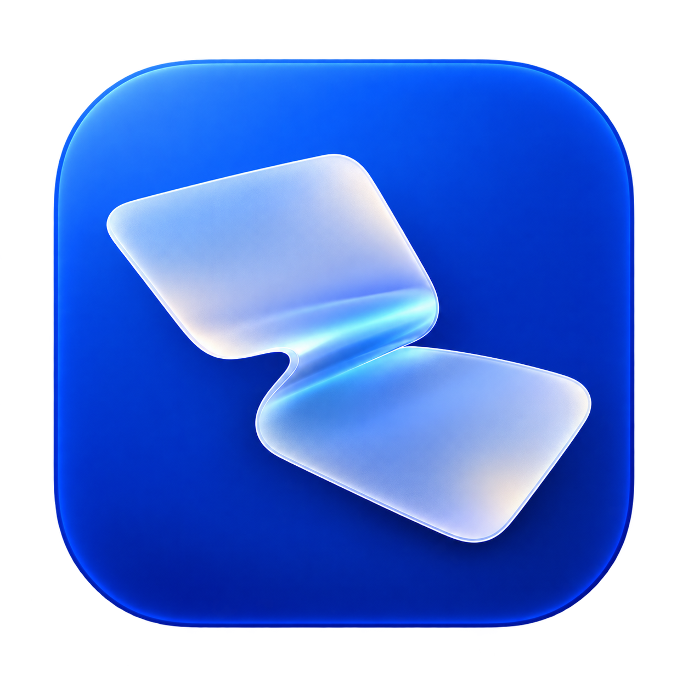
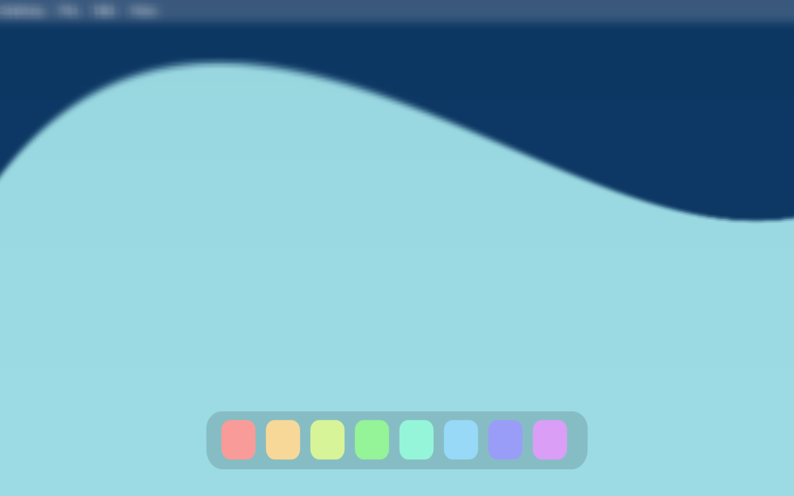

<p align="center"></p>

# macbook-fold

A native, open-source MacBook utility inspired by the iPhone Duo's folding transition. Your desktop stretches and progressively softens as you lower the lid, staying filled to every edge.

The app's current working title is **Fold**. It runs locally, with no account, analytics, recording files, network calls, or paid dependencies. MIT licensed.

[Download the app](https://github.com/mhadifilms/macbook-fold/releases/latest) · [Motion study](docs/motion-study.md) · [Preview video](docs/motion-preview.mp4)



## Use

1. Download and unzip the release, then move **Fold.app** to Applications.
2. Open it. At startup, allow Screen Recording if macOS asks. If access was newly granted, reopen the app.
3. Choose **Follow lid**. The original preset activates below 100° and clears as you open the lid.
4. Press **Command-Shift-Escape** to pause instantly. The menu bar also has Pause and Quit. Escape pauses while the app is focused.

The generated Settings preview needs no permission. Drag its angle slider to explore the effect. **Preview desktop · 8 sec** tries the real effect and clears automatically. **Restore original** restores the reference-inspired default.

The overlay changes pixels, not other apps' click targets. Pause before clicking displaced controls.

## What changed in this version

- Full-screen texture sampling removes the previous black gutters.
- Blur increases toward the moving top edge; the bottom hinge stays clearer.
- Gentle stretch and subtle directional shade replace the shrinking trapezoid and heavy global darkening.
- Critically damped smoothing interpolates between sensor readings and preserves velocity when you reverse direction.
- Display-synchronized rendering requests up to 120 Hz on supported displays; actual cadence follows the display and macOS.
- Capture is kept ready across folds and idles at 1 fps while the desktop is clear. Pausing releases it.
- A single startup permission path asks only when permission is missing. Follow lid, Preview, and repeated folds never request authorization.
- New launches ask older copies of this app to quit, preventing competing overlays/hotkeys.

## Permissions and signing

ScreenCaptureKit needs macOS Screen Recording access to draw the desktop effect. Audio is not captured. Frames stay in memory and are never saved or uploaded by normal operation.

The app checks permission on startup and requests it only if missing. Denying it leaves the generated preview available. macOS may still show its own periodic capture reminders; the app cannot suppress system security UI. Keep the same signed app in Applications to preserve its identity. Unsigned/ad-hoc rebuilds or changing signing identity may require authorization again.

The build script supports a Developer ID certificate through `SIGNING_IDENTITY`; it does not bundle credentials or create a signing identity. See each release's notes for signing and notarization status.

## Requirements

- Apple silicon Mac, macOS 14 Sonoma or later.
- Automatic operation requires an accessible MacBook lid-angle HID sensor. Availability is detected at runtime; tested on an M3 Max MacBook Pro.
- Metal-capable GPU. Capture resolution is capped at 2560 pixels wide.

This adapts the Duo's appearance to a MacBook's single rigid display and bottom hinge. It doesn't reproduce the two-screen content handoff or contain Apple/Bendy code or artwork. The reference parameters are a visual approximation, not Apple's unpublished timing data.

## Build

With Xcode or Apple's command-line tools installed:

```sh
./build.sh
```

The output is `build/Fold.app`. To sign with your existing certificate:

```sh
SIGNING_IDENTITY='Developer ID Application: Your Name (TEAMID)' ./build.sh
```

Set `BUILD_DIR` to choose another output folder. `APP_NAME` controls the bundle's display name. No package downloads are needed.

## Test

Run the graphics checks in a logged-in graphical macOS session with a Metal GPU:

```sh
build/Fold.app/Contents/MacOS/Fold --self-test
```

The checks exercise sensor decoding, startup permission logic without prompting, motion convergence/reversals, upright image orientation, and complete edge coverage at multiple angles/styles. They benchmark GPU work using generated artwork.

The following opt-in integration test briefly displays the effect for a bounded 12-second check, replaces older running app instances, requires existing screen permission, and saves no screen images:

```sh
build/Fold.app/Contents/MacOS/Fold --integration-test
```

It checks live capture, Metal presentation, clearing and reopening without a stream restart, timed completion, and pause during asynchronous startup. [Verification details](docs/verification.md).

## Source layout

- `Sources/AppModel.swift`: lifecycle, menu bar, authorization, capture session, stop handling.
- `Sources/LidSensor.swift`: direct IOKit HID feature report reading, at 60 Hz.
- `Sources/FoldRenderer.swift`: display-paced Metal presentation and motion interpolation.
- `Resources/Fold.metal`: full-screen stretch, spatial blur, and shade.
- `Sources/DesktopCapture.swift`: ScreenCaptureKit with this app excluded.
- `Sources/SettingsView.swift`: native SwiftUI controls.

## Credits

Visual reference: [Apple's iPhone Duo](https://www.apple.com/iphone-duo/) and [close-up hands-on footage](https://www.reddit.com/r/UI_Design/comments/1wc0nut/cool_animations_on_the_new_iphone_duo/). Mac utility concept inspired by [Bendy](https://trybendy.app/). Sensor protocol reference: [mac-angle](https://github.com/ufoym/mac-angle/blob/main/angle.cpp). Implementation, sample artwork, and logo are independent. Reference videos are not included.
